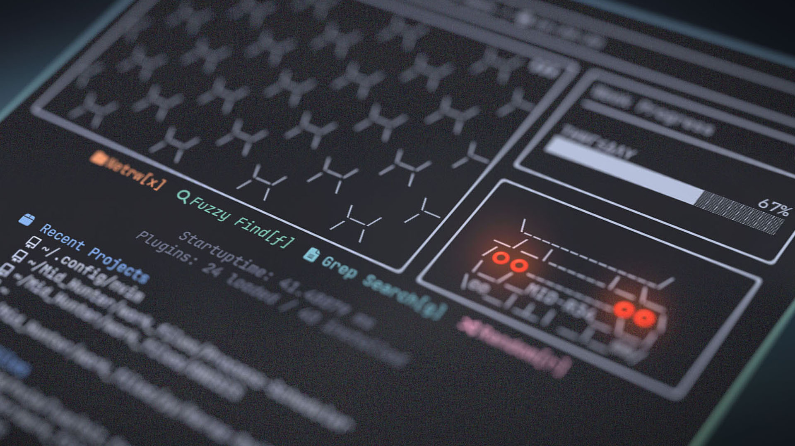
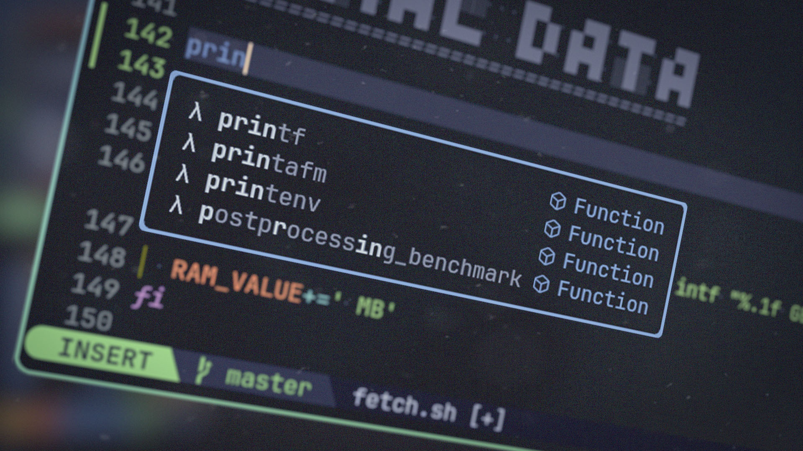
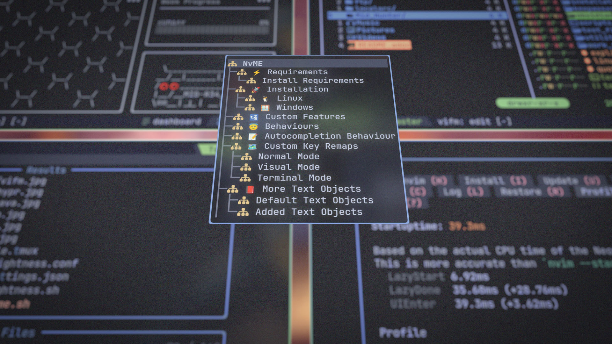

= NvME
/ˈɛnvi mi:/

A **ME**ticulous nvim distribution, crafted from scratch solely for **ME** with
every features and keybindings configured to offer supre**ME** comfort and
comple**ME**nt **ME** workflow im**ME**nsely.

== ⚡ Requirements

* *Neovim* (Needs to be built with LuaJIT)
* *GCC*: For compiling treesitter languages in Linux
* *Zig Compiler*: For compiling treesitter languages in Windows
* *git*: For git integration, cloning plugin repos etc.
* *ripgrep*: For live grep
* *fd*: For Find Files
* *vifm*: File Manager
* *lazygit*: Git UI
* *python*: For Python Language Server & Black Formatter
* *nodejs*: For other Language Servers and Formatters
* *live-server* (npm): For local HTML Server

=== Install Requirements

.🅐 Arch Based System (pacman)
[source,bash]
----
sudo pacman -S neovim git ripgrep fd vifm lazygit python npm
sudo npm install -g live-server
----

== 🚀 Installation

=== 🐧 Linux

* Suggested Compiler: *GCC*

.bash / zsh
[source,bash]
----
ME=~/.config/nvim;if [ -d $ME ]; then mv $ME ${ME}_backup/;fi
git clone https://github.com/MidHunterX/NvME $ME --depth 1 && nvim
----

.fish
[source,fish]
----
set ME ~/.config/nvim; test -d $ME; and mv $ME {$ME}_backup
git clone https://github.com/MidHunterX/NvME $ME --depth 1 && nvim
----

=== 🪟 Windows

* Suggested Compiler: *Zig Compiler*

[source,cmd]
----
git clone https://github.com/MidHunterX/NvME %%localappdata\nvim --depth 1 && nvim
----

== 😇 Behaviours

Important Stuff on Top Left Side::
Macro Record Status posess high importance until recording is stopped.
Therefore it stays on left side only for the time being recorded for a macro.

Less Important Stuff on Top Right Side::
Buffer list is not needed at all times, therefore it doesn't have that much
importance to interfere with the code in buffer.

Yank into System Clipboard by Default::
Less hastle when copy pasting between windows frequently.

Highlight Yanked Text for 150ms::
Quickly know how much text got yanked when using direct yank commands.

Scroll past EOF in buffer with `j`::
Personal preference for EOF to not be stuck at the bottom of the screen.

Show Relative Line Number on Normal Mode::
That's the only time you need Relative Line Numbers for Jumping Lines.

Show Normal Line Number on Insert Mode::
Useful when doing substitution based on line numbers.

== 🛂 Custom Features

image:./img/nvim_hitfont.jpg[]

* Convert text to Hit Font with `:HitFont`
* Toggle Boolean Values with `C-a`
* Trim trailing lines and Write Buffer with `<leader>w`
* Git add . + commit -m with `<leader>gc` (Replaced with Lazygit)
* Execute files with `F5` or `:lua Execute_order_69()`
* Run file formatter with `<leader>fm` or `:lua Run_formatter()`

== 📝 Autocompletion Behaviour

* Autocompletion suggestions keep popping while typing
* If the suggestion box is visible, you can do the following:
* Select Next entries with: `C-n`, `Down`
* Select Previous entries with: `C-p`, `Up`
* Accept an entry with `CR`, `i`, `C-i`
* Cancel Completion with `C-e`, `o`, `C-o`

If selected entry is a snippet, use `TAB` & `S-Tab` for jumping around.

.`Show Completion Workflows`
[%collapsible]
====

[discrete]
=== Autocompletion: Terminal Style
[source,yaml]
----
Select: Tab, S-Tab
Accept: Enter
----

[discrete]
=== Autocompletion: Ide Style
[source,yaml]
----
Select: Down, Up
Accept: Enter
----

[discrete]
=== Autocompletion: Vim / Emacs Style
[source,yaml]
----
Select: C-n, C-p
Accept: Enter
Reject: C-e
----

[discrete]
=== Autocompletion: Personal Style
[source,yaml]
----
Select: Down, Up / Tab, S-Tab
Accept: i
Reject: o
----

====

== 🗺️ Custom Key Remaps

=== Normal Mode
[%header]
|===
| Key          | Description
| `u`          | Undo
| `U`          | Redo
| `H`          | Move cursor to start `^` of a line
| `L`          | Move cursor to end `$` of a line
| `<C-u>`      | Scroll Half page up with Cursor centered
| `<C-d>`      | Scroll Half page down with Cursor centered
| `<A-h>`      | Go to Previous Buffer
| `<A-l>`      | Go to Next Buffer
| `<Space>`    | Leader Key
| `<leader>rr` | Replace word under cursor with Regex
| `<leader>x`  | Delete Current Buffer
| `<leader>d`  | Deletes selection into blackhole register
| `<leader>p`  | Deletes selection into blackhole register and paste
| `ghh`        | Git Preview Hunk
| `ghn`        | Git Goto Next Hunk
| `ghp`        | Git Goto Previous Hunk
|===

=== Visual Mode
[%header]
|===
| Key       | Description
| `<Space>` | Leader
| `J`       | Move line Down with autoindent
| `K`       | Move line Up with autoindent
| `<`       | Indent line/selection to Left
| `>`       | Indent line/selection to Right
| `H`       | Move cursor to start `^` of a line
| `L`       | Move cursor to end `$` of a line
|===

=== Terminal Mode
[%header]
|===
| Key      | Description
| `<C-w>n` | Return to Normal Mode
|===

== 📕 More Text Objects

=== Default Text Objects
[%header]
|===
| Default Text Objects    | Description
| `p`                     | Paragraph
| `w`                     | Word
| `"` `'` `'` `"`         | Strings
| `[` `{` `(` `)` `}` `]` | Brackets
| `t`                     | Markup Tags
|===

=== Added Text Objects
[%header]
|===
| New Text Objects | Description
| `i`              | Conditional
| `l`              | Loop
| `f`              | Function
| `m`              | Method
| `c`              | Class
| `a`              | Argument
| `=`              | Assignment
| `:`              | Propery
|===

== 🔌 Plugins

* Navigate through code Functions/Methods with `aerial.nvim`
* Lazy Loading Plugin Manager `lazy.nvim`
* Autoclosing Braces and Tags with `nvim-autopairs`
* Disable Features on Large Files with `bigfile.nvim`
* Default Colorscheme: `catppuccin`
* Fancy Dashboard with `dashboard-nvim`
* Gitsigns on Signcolumn with `gitsigns.nvim`
* Install LSP servers, DAP servers, Linters and Formatters with `mason.nvim`
* NeoVim LSP Configuration with `nvim-lspconfig`
* Code Autocompletion with `nvim-cmp`
* Code Snippets with `luasnip` + `friendly-snippets`
* Tab out of Brackets and Quotes with `neotab.nvim`
* Scope based Indentation Lines with `indent-blankline.nvim`
* Lazygit Integration with `lazygit.nvim`
* Fast Cursor Navigation with `leap.nvim`
* Bracket pair highlighting with `rainbow-delimiters.nvim`
* Status Line and Buffer Line with `lualine.nvim`
* Change, Delete surrounding brackets or quotes quickly with `nvim-surround`
* Fuzzy search project files, Grep text search etc. with `telescope.nvim`
* Navigate through undo history tree with `telescope-undo.nvim`
* Convert, Manipulate and Pick Colors with `ccc.nvim`
* Semantic based Syntax Highlighting with `nvim-treesitter`
* See code context on top with `nvim-treesitter-context` instead of breadcrumbs
* View live Treesitter parsing tree with `nvim-treesitter/playground`
* Added more text objects with `nvim-treesitter-textobjects`
* Manage and Explore files and folders with `vifm.vim`
* Visible Color Codes on buffer with `nvim-coloriser.lua`
* Distraction free Coding Zen Mode with `zen-mode.nvim` + `twilight.nvim`
