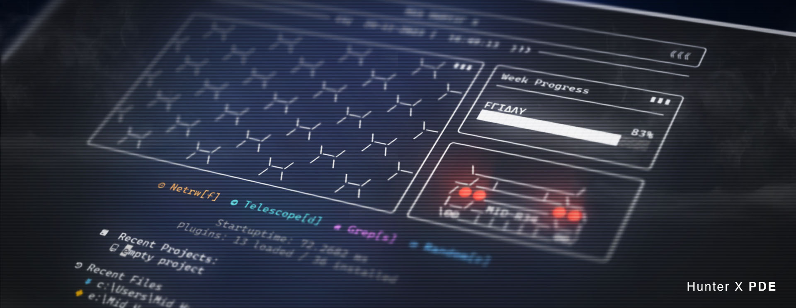

# HunterX PDE (Personal Development Environment)

HunterX PDE is a personalized NeoVim distribution crafted to make programming much more comfortable while facilitating an in-depth understanding of IDE components at their fundamental level.

## Behaviours

- H and L moves to line start and end instead of page top and bottom
- Centers cursor while scrolling half page to avoid disorientation
- Highlights text for 150ms on yank for confirmation
- Ability to scroll past EOF for more comfort
- Toggles relative number on and off in normal and insert modes (personal preference)
- Uses system clipboard by default
- 2 space indentation set as default
- 4 space indentation for selected files: { "c", "cpp", "py", "java", "cs" }

## New Text Objects

| Object | Description |
| ------ | ----------- |
| P      | Paragraph   |
| T      | Markup Tags |
| I      | Conditional |
| L      | Loop        |
| F      | Function    |
| M      | Method      |
| C      | Class       |
| A      | Argument    |
| =      | Assignment  |
| :      | Propery     |

## Installation

Linux:

```
git clone https://github.com/MidHunterX/HunterX-PDE ~/.config/nvim --depth 1 && nvim
```

Windows:

- You must install Zig Compiler before executing the following command.

```
git clone https://github.com/MidHunterX/HunterX-PDE %%localappdata\nvim --depth 1 && nvim
```
